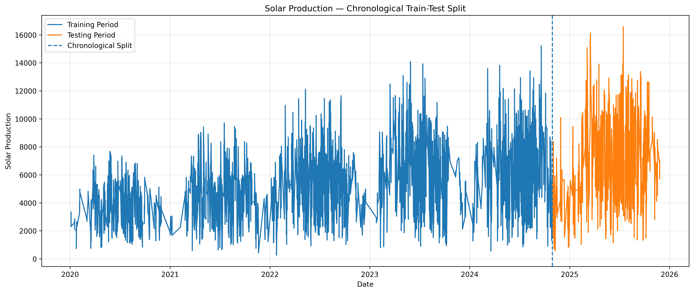
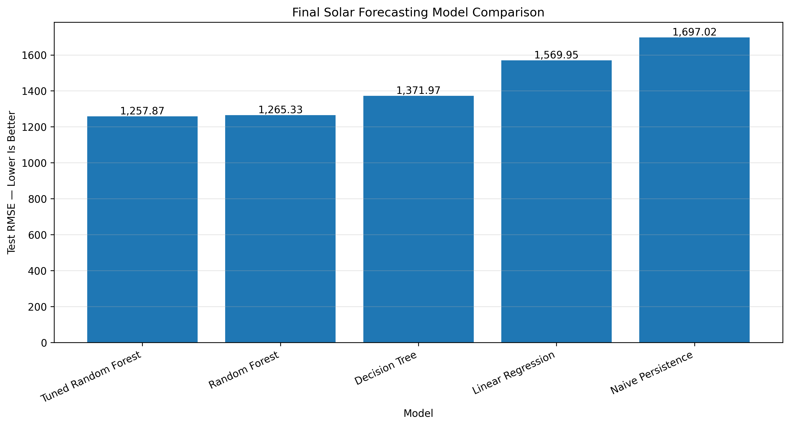
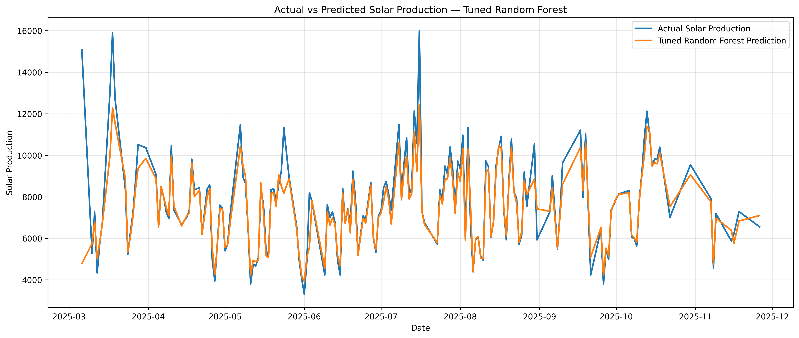

# Solar Energy Production Forecasting


A machine learning time-series forecasting project that predicts solar-energy production using a chronological, leakage-safe workflow.

The project follows best practices for time-series machine learning, including chronological data splitting, TimeSeriesSplit cross-validation, feature engineering with historical observations, model comparison, hyperparameter tuning, and explainable model evaluation.

---

## Project Highlights

✔ Leakage-safe forecasting workflow

✔ Chronological 80/20 Train-Test Split

✔ TimeSeriesSplit Cross Validation

✔ Historical Lag & Rolling Features

✔ Multiple Regression Models Comparison

✔ Persistence Baseline Forecast

✔ Hyperparameter Optimization

✔ Residual & Overfitting Analysis

✔ Explainable Feature Importance

✔ Saved Production Pipeline

---

## Project Objective

The objective of this project is to build a reliable machine learning workflow capable of forecasting **solar-energy production** while preserving the temporal structure of the data.

Unlike traditional machine learning problems, forecasting requires future observations to remain unseen during training. Therefore, the entire workflow was designed to prevent data leakage and produce realistic performance estimates.

---

## Dataset

Expected dataset:

```text
Energy Production Dataset.csv
```

### Main Features

- Date
- Start_Hour
- End_Hour
- Source
- Season
- Production

---

## Machine Learning Workflow

1. Load and inspect the dataset
2. Remove duplicate records
3. Convert and sort timestamps chronologically
4. Perform Exploratory Data Analysis (EDA)
5. Generate historical time-series features
6. Create leakage-safe lag and rolling statistics
7. Perform chronological train-test split
8. Build preprocessing pipeline
9. Train multiple regression models
10. Evaluate using TimeSeriesSplit
11. Compare against a persistence baseline
12. Perform residual analysis
13. Check overfitting
14. Tune Random Forest using GridSearchCV
15. Interpret feature importance
16. Save the trained forecasting pipeline

---

## Feature Engineering

Historical information is generated from previously observed **solar-production values**.

### Historical Features

- Lag_1
- Lag_2
- Rolling_Mean_3

### Calendar Features

- Month
- Day
- Day of Week
- Weekend
- Cyclical Month Encoding
- Cyclical Weekday Encoding

Rolling statistics are calculated using shifted historical observations only, ensuring that the current production value never leaks into its own predictors.

---

## Data Splitting Strategy

The dataset is divided chronologically:

- **80% Training**
- **20% Future Testing**

A random split is intentionally avoided because forecasting models must always predict future observations rather than randomly shuffled samples.

---

## Data Preprocessing

A complete Scikit-learn Pipeline is used to ensure reproducibility.

### Numerical Features

- Median Imputation
- StandardScaler

### Categorical Features

- Most Frequent Imputation
- OneHotEncoder

This prevents preprocessing leakage and keeps the workflow production-ready.

---

## Models Evaluated

The following regression algorithms are compared:

- Linear Regression
- Decision Tree Regressor
- Random Forest Regressor


---

# Results

The following figures summarize the key outcomes of the forecasting workflow.

## Chronological Train-Test Split

The dataset was divided chronologically to preserve the temporal order of observations. Earlier records were used for training, while the latest observations were reserved for evaluating future forecasting performance.

<p align="center">
  
</p>

---

## Final Model Comparison

The tuned Random Forest achieved the lowest RMSE compared with the persistence baseline and the other regression models.

<p align="center">
  
</p>

---

## Actual vs Predicted Solar Production

The tuned Random Forest closely follows the observed solar-energy production during the unseen test period.

<p align="center">
  
</p>

---

## Baseline Forecast

Before training machine learning models, a persistence baseline is evaluated:

```text
Prediction(t) = Production(t-1)
```

This provides a minimum benchmark to verify that the trained models genuinely improve forecasting performance.

---

## Model Evaluation

Models are evaluated using:

- Mean Absolute Error (MAE)
- Root Mean Squared Error (RMSE)
- R² Score

Additional analyses include:

- TimeSeriesSplit Cross Validation
- Chronological Holdout Evaluation
- Residual Analysis
- Actual vs Predicted Visualization
- Train vs Test Error Comparison

---

## Time-Series Cross Validation

Instead of traditional K-Fold validation, the project uses:

```python
TimeSeriesSplit()
```

Each validation fold only predicts future observations using historical data, providing a more realistic estimate of forecasting performance.

---

## Hyperparameter Optimization

The Random Forest model is optimized using:

```python
GridSearchCV()
```

Optimized parameters include:

- n_estimators
- max_depth
- min_samples_split
- min_samples_leaf
- max_features

The best model is selected according to RMSE obtained from TimeSeriesSplit.

---


## Feature Importance

The final tuned Random Forest model identifies the most influential forecasting variables.

Typical high-impact features include:

- Previous Production (Lag Features)
- Rolling Mean
- Seasonal Information
- Calendar Features
- Time Features

These results provide insight into which historical patterns contribute most to accurate solar-energy forecasting.

---

## Saved Model

The complete preprocessing and forecasting pipeline is saved as:

```text
solar_energy_forecasting_pipeline.joblib
```

The model file is intentionally excluded from GitHub because of its size.

---

## Installation

```bash
pip install numpy pandas matplotlib scikit-learn joblib jupyter
```

---

## Running the Project

1. Clone the repository.
2. Ensure the dataset is located inside the data/ directory.
3. Open notebooks/renewable_energy_forecasting.ipynb.
4. Run all notebook cells.
5. Review the evaluation metrics and visualizations.

---

## Project Structure

```text
Renewable-Energy-Forecasting/
│
├── data/
│   └── Energy Production Dataset.csv
│
├── images/
│   ├── chronological_train_test_split.png
│   ├── final_model_comparison.png
│   └── actual_vs_predicted.png
│
├── models/
│   └── solar_energy_forecasting_pipeline.joblib
│
├── notebooks/
│   └── renewable_energy_forecasting.ipynb
│
├── README.md
├── PROJECT_SUMMARY.md
├── requirements.txt
└── .gitignore
```

---

## Key Findings

- Chronological evaluation produces more realistic forecasting performance than random train-test splitting.
- Lag and rolling features significantly improve predictive accuracy.
- TimeSeriesSplit provides reliable validation for temporal data.
- The tuned Random Forest achieved the best forecasting performance.
- Historical production patterns are the strongest predictors of future solar-energy production.

---

## Project Limitations

- Weather conditions are not available.
- Maintenance events are not included.
- Equipment operational status is unavailable.
- Only a single future holdout period is evaluated.
- The project focuses exclusively on solar-energy production.

---

## Future Improvements

- Integrate weather and environmental variables
- Apply Walk-Forward Validation
- Compare XGBoost, LightGBM, and CatBoost
- Explore deep learning forecasting models (LSTM, GRU)
- Generate prediction intervals
- Deploy the forecasting model using FastAPI or Streamlit
---

## Technologies Used

- Python
- Pandas
- NumPy
- Scikit-learn
- Matplotlib
- Joblib
- Jupyter Notebook

---

## Author

**Layan Mousa**
